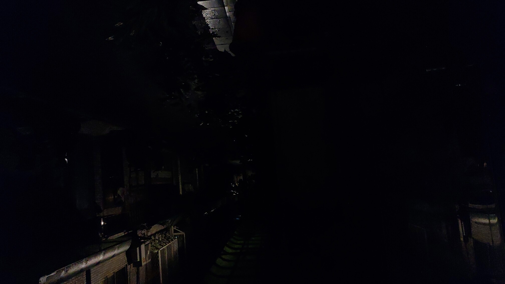
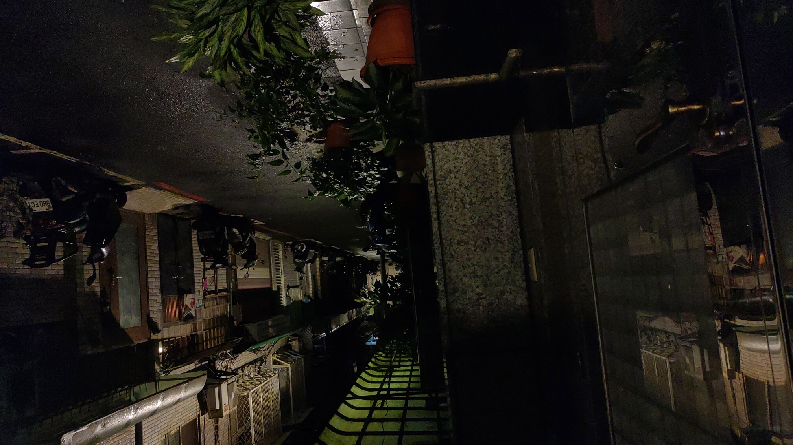
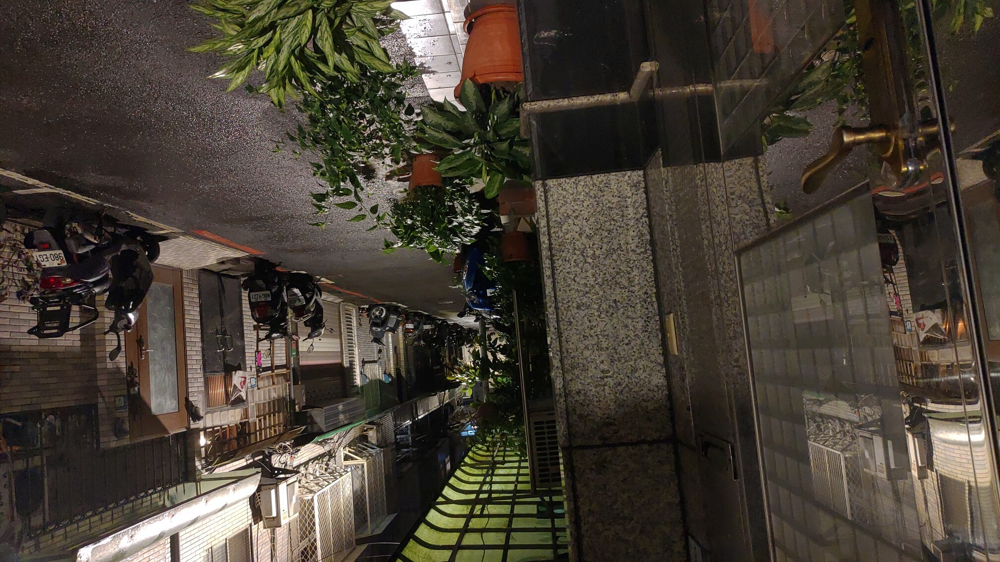
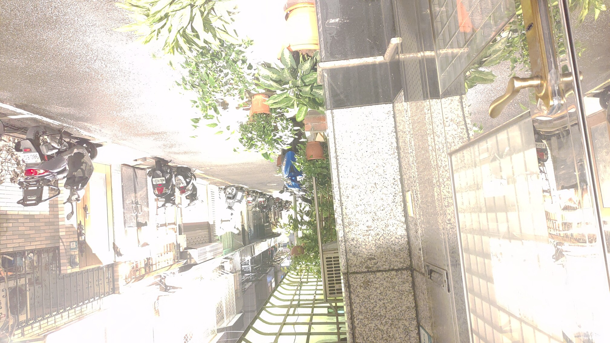
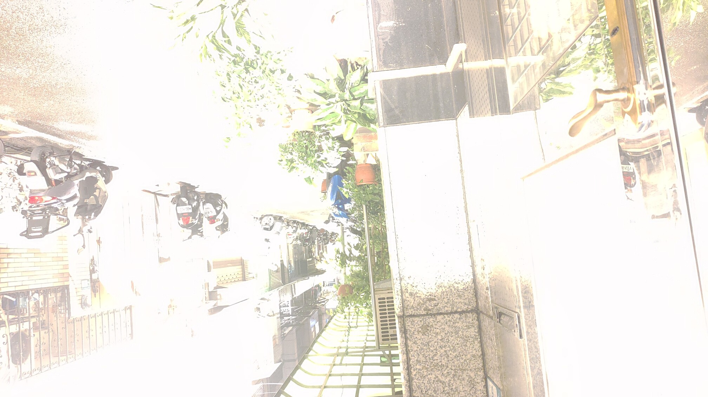
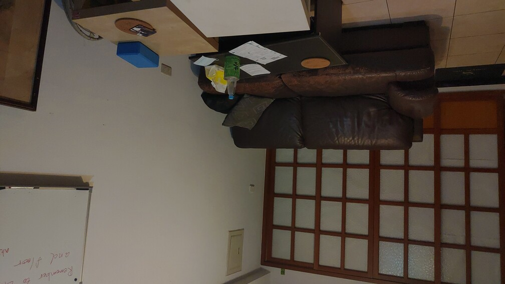
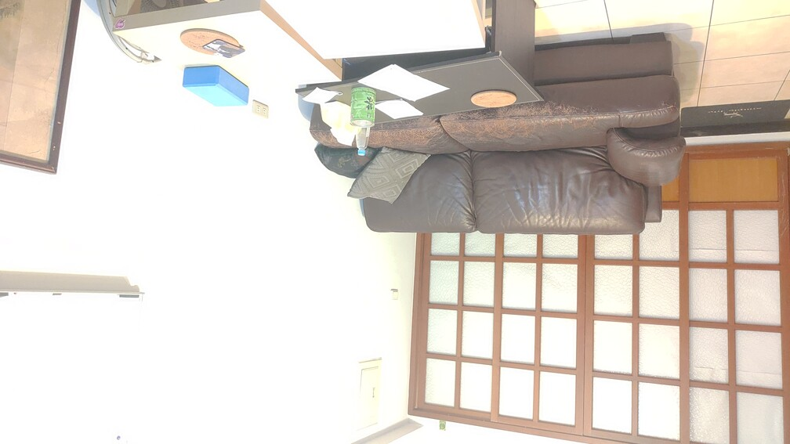
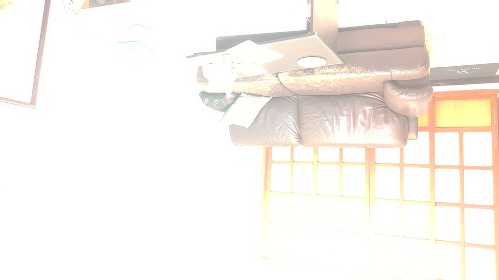

# VFX Project1 High Dynamic Range imaging

## Enviroment
python 3.9 \
opencv 4.5.4\
numpy 1.16.6
## Usage
### 1. hdr.sh: Computing radience map to output.npy 
hdr.sh will save the radience map into output.npy and output.hdr.

    bash hdr.sh ${filepath} ${output}
Parameters: for sampling srow x scol for each pictures.
* srow : defalut 20
* scol :  defalut 20

### 2. tone.sh: for computing tonemapping to output.npy
tone.sh will save 3x2 different pictures into save directory.

    bash tone.sh ${hdr output name} ${save directory}

Parameters: Reinhard's tonemapping parameters.
* key : defalut 0.72
* white :  defalut 1
* phi : 8
* threshold : 0.05

### 3. hw1.sh: reproduce the hdr image for coach and road.
    
    bash tone.sh
## Algorithm implemented

### 1 HDR radiance map: 
Debevec's method taught from class.
1. response curve: for data sampling, resize the picture to srow x scol.
2. And restore for each pixel with recoverd g.
### 2 ToneMapping : 
1. Global operator and Local operator from 

        Erik Reinhard, Michael Stark, Peter Shirley, Jim Ferwerda, Photographics Tone Reproduction for Digital Images, SIGGRAPH 2002.
    The tonemapping will create 2x3=6 types of pictures. 

2. Blend Local and Global operator:\

    Following from https://github.com/JCly-rikiu/HDR, the blend operator provides a way to merge two operators. \
So I have also Blend Local and Global operators together.
[1, 0.5, 0] for global, blending and local respectively. 

1. RGB transform: \
    For RGB transforming, I have tried using clip and normalizing.\

    Clipping cut the value over 255 to 255. \

    Normalizing performs log transform to toned radience map and do cv.MINMAX normalizing.

# Result
由於Normalized過後圖片會經過log轉換，因此色彩差距會變小，圖片會較為柔和。Clip的則會比較銳利，對比較大。

可以看到Local operator的在Road裡的柵欄、車牌還有Coach中桌上的紙確實都比Global的清晰，不過物體間的邊線有點太突出。像是盆栽就會很有顆粒感，blend過後可以稍微降低這種感覺。
## Road

### 15 picture range from 1/652 to 2 exposure second.
<table>
<tr>

<th> 1/652 sec</th>
<th>  1/82sec</th>
<th>   1/16sec</th>
<th>   1 sec</th>
<th>   2 sec</th>

</tr>
</table>

### clipping
<table>
<tr>
<th>  Global</th>
<tr>
<th>  Local</th>
<tr>
<th>  Blend</th>
<tr>
</tr>
</table>

### norrmalized

<table>
<tr>
<th> Global</th>
<tr>
<th> Local</th>
<tr>
<th> Blend</th>
<tr>
</tr>
</table>

## Coach

### 23 picture range from 1/652 to 1/2 exposure second.
<table>
<tr>
<th> 1/652 sec</th>
<th>  1/326sec</th>
<th>   1/68sec</th>
<th>   1/7 sec</th>
<th>   1/2 sec</th>

</tr>
</table>

### clipping
<table>
<tr>
<th>  Global</th>
<tr>
<th>  Local</th>
<tr>
<th>  Blend</th>
<tr>
</tr>
</table>

### norrmalized

<table>
<tr>
<th> Global</th>
<tr>
<th> Local</th>
<tr>
<th> Blend</th>
<tr>
</tr>
</table>
